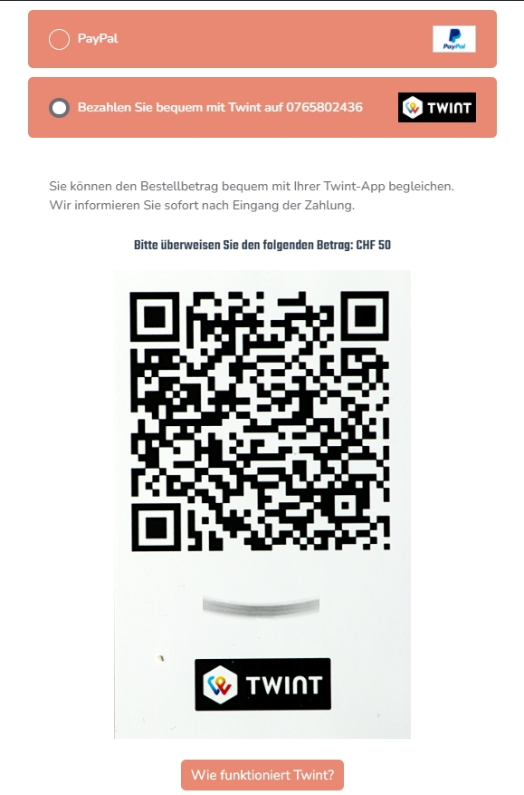
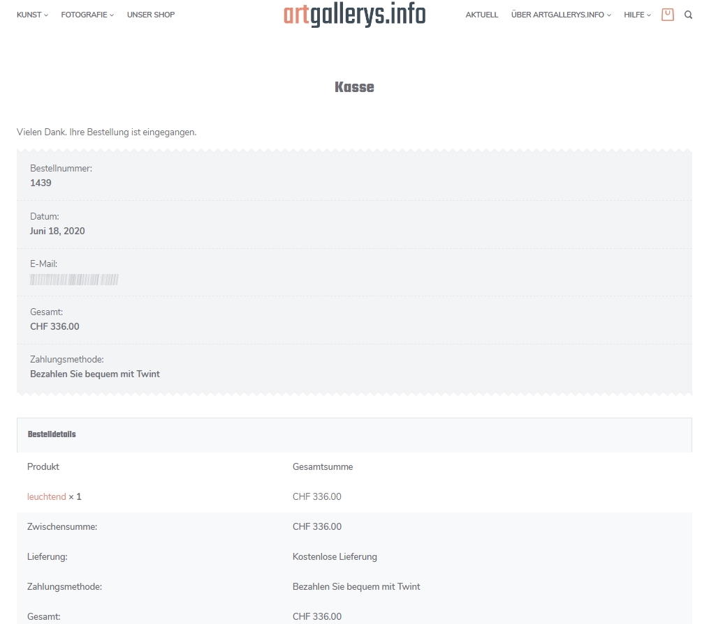
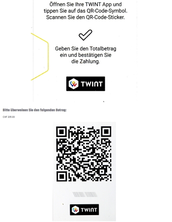
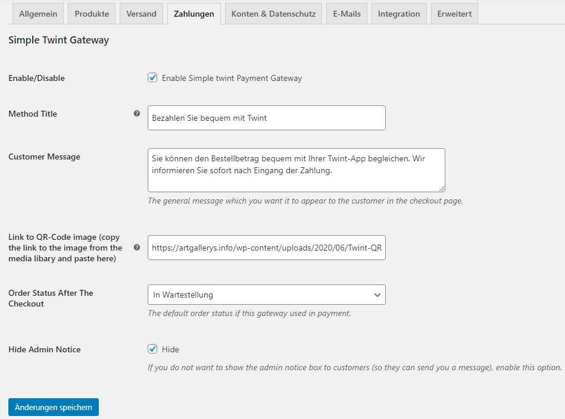

# WooCommerce Simple Twint #

## Beschreibung ##

### Ermöglicht eine einfache (und kostenlose) Möglichkeit Twint in einem WooCommerce-Shop zu benützen ###

Aktuell gibt es nur Plugins für Twint zum Kaufen, ab 99 Franken bis 200 Franken im Jahr (falls man Updates auch nach einem Jahr möchte). Wir finden, dass gerade kleine Shops eine quelloffene Lösung haben sollten, die nichts kostet und auch wenig Wartung (keine technischen Probleme punkto Verbindung zwischen Twint und dem Shop; muss auch nicht bei Änderungen von Twint angepasst werden) benötigt.

Sie hat jedoch zwei grosse Nachteile gegenüber den Lösungen, die gekauft werden können:

- der QR-Code zum Einlesen muss als Bild (JPEG, PNG usw.) in den Shop raufgeladen werden. Falls Sie noch keinen QR-Code besitzen, können Sie ihn direkt aus dem Twint-Konto (muss ein Geschäftskonto sein) bestellen. Diese Broschüre von Twint erklärt wie: https://www.twint.ch/content/uploads/2019/10/Anleitung-TWINT-QR-Code-Sticker-bestellen.pdf.
- es gibt keine automatische Rückmeldung der eingegangen Zahlung direkt im Shop, weil es ja keine direkte Verbindung von Shop und Twint gibt. Jedoch erhält der Shop-Manager sofort eine SMS oder E-Mail-Benachrichtigung im Twint-Konto und kann somit manuell in WooCommerce die Bestellung auf den Status fertig gestellt setzen und die Lieferung veranlassen.

Da gemäss des E-Commerce Stimmungsbarometer der Post (Link: https://e-commerce.post.ch/download/de/E-Commerce_Stimmungsbarometer_2019.pdf) etwa 23 % der Nutzer von Online-Shops in der Schweiz mobile Zahlungen benützen (dazu gehören Twint, Apple Pay, Google Pay usw.), finden wir, das diese simple Lösung durchaus für Shops mit wenigen Twint-Zahlungen Sinn macht, vor allem auch Shops mit physischer Präsenz, die bereits einen QR-Code den Kunden zeigen. Es liegt ja im Ermessen jedes Shop-Betreibers, ob die Umsätze über Twint eine bessere Anbindung über ein kommerzielles WooCommerce-Plugin rechtfertigen oder nicht.

Übrigens: Am Beliebtesten bleiben in der Schweiz als Online-Zahlungsmittel die Kreditkarte mit 76 % und Zahlung auf Rechnung mit 75 %.

## Wie funktioniert das Plugin? ###

### Kassenseite zeigt neue Zahlungsmöglichkeit Twint ###

Die Zahlungsmöglichkeit mit dem Titel "Bezahlen Sie bequem mit Twint" mit Instruktionen ist aktiv:

### Die Bestätigungsseite (Thank You page) ###

Der obere Teil der angezeigten Bestellbestätigung sieht wie üblich aus:

Weiter unten erscheinen die Instruktionen für Twint mit dem zu bezahlenden Betrag sowie der QR-Code (nur der obere Teil angezeigt):

Die Kundin kann jetzt den QR-Code einlesen und den korrekten Betrag eingeben und die Zahlung auslösen.

### Was muss der Shop-Manager machen? ###

Im Twint-Konto des Shops sollte automatisch die Benachrichtigung per SMS und/oder E-Mail bei Zahlungseingang reinkommen. Aufgrund der Infos der Benachrichtigung (Name, Betrag, Zeit) sollte es kein Problem sein, die Bestellung auf der Seite "Bestellungen" zu finden und auf den Status "Fertig gestellt" zu setzen. So wird eine neue E-Mail an die Kundin ausgelöst und die Lieferung der Bestellung kann vorgenommen werden (allenfalls noch vorher mit Eingabe der Sendungsnummer, siehe anderes Plugin hier).

### Einstellungsseite von WooCommerce Simple Twint ###

Das Bildschirmfoto unten zeigt alle möglichen Optionen:

- Sie können den Titel und die Nachricht an die Kundin (Instruktionen) setzen;
- Wichtig: nachdem Sie den Scan (also das Bild) Ihres QR-Codes (den Sie per Post von Twint erhalten) in den Shop geladen haben, gehen Sie zu "Medien" und kopieren das komplette Link zum Bild in die Zwischenablage und fügen Sie es in das Feld für "Link zu QR-Code image" ein.
- Der Bestellstatus ist automatisch auf "In Wartestellung" gestellt.
- Die Notiz an den Shop ist voreingestellt deaktiviert.

## Installation ##
ZIP-Datei unterladen und das Plugin-Verzeichnis auspacken.

Sie können es direkt in das Verzeichnis `/wp-content/plugins/`Ihrer WordPress-Installation platzieren und dann von der Seite "Plugins" aktivieren, oder Sie können dort zu "Plugins" - "Installieren" - "Plugin Raufladen" gehen und so das Plugin gleich als ZIP-Datei raufladen und anschliessend aktivieren.

Gehen Sie dann zu "WooCommerce" - "Einstellungen" and aktivieren Sie diese Zahlungsmöglichkeit unter dem Reiter (Tab) "Kasse".

## Changelog ##

### 1.0.0 ###
First version: tested with Woocommerce 4.2 and WordPress 5.4.1
